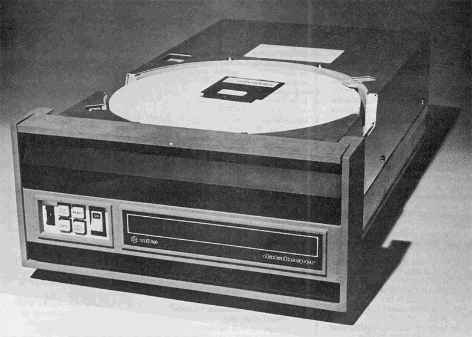

# Altair hard disk operation (MITS 88-HDSK Controller)

The Altair-Duino system can access four hard disks, specified with the switches and the use of the AUX1 and AUX2 toggles. In other words, this is not going to work on a real Altair - it's a trick to simulate using hard disks on the Altair-Duino. There is no way to connect genuine MITS hard drives to the Altair-Duino (just in case you happened to find some).

Note: This section requires that a SD card be present on your Altair-Duino. 

**Display a list of available hard disk images**

To see a list of available disk images that can be loaded, enter the following pattern on the address toggle switches (1 means the switch is up):

| 15 | 14 | 13 | 12 | 11 | 10 | 9 |  8 | 7 | 6 | 5 | 4 | 3 | 2 | 1 | 0 |
|----|----|----|----|----|----|---|----|---|---|---|---|---|---|---|---|
| 0  | 0  | 1  | 1  | 0  | 0  | 0 | 0  | 0 | 0 | 0 | 0 | 0 | 0 | 0 | 0 |

And toggle **AUX2** to **DOWN**.

Note: If you have added your own disks to the local file system (see **The Altair Local File System**), you will need to manually add the descriptions to the HDSKDIR.TXT file. Be sure to terminate each description with a CR and LF character.

**Mount a specific hard disk in the default drive**

The hard disks on the Altair-Duino's file system are named "HDSK01.DSK", "HDSK02.DSK" and so on.  To select a specific disk, set switches **13** and **12** to **UP** and then enter the binary representation of the disk name on switches **7** to **0**:

| 15 | 14 | 13 | 12 | 11 | 10 | 9 |  8 | 7 | 6 | 5 | 4 | 3 | 2 | 1 | 0 |
|----|----|----|----|----|----|---|----|---|---|---|---|---|---|---|---|
| 0  | 0  | 1  | 1  | 0  | 0  | 0 | 0  | x | x | x | x | x | x | x | x |

For example, to mount disk HDSK03.DSK (by default, **Mike Douglas' CP/M**), set the following switches:

| 15 | 14 | 13 | 12 | 11 | 10 | 9 |  8 | 7 | 6 | 5 | 4 | 3 | 2 | 1 | 0 |
|----|----|----|----|----|----|---|----|---|---|---|---|---|---|---|---|
| 0  | 0  | 1  | 1  | 0  | 0  | 0 | 0  | 0 | 0 | 0 | 0 | 0 | 0 | 1 | 1 |

Note: This will mount the disk, but it will not run anything. If you need to boot it, see "Boot from a hard disk" below.

**Selecting different drives and platters**

Note: the exact number of hard disk drives available depends on the build of the Altair-Duino your computer has been programmed to support. By default only 1 drive is available, but you can re-build the Altair-Duino image if you need more. See "Building your Altair-Duino image".

The Altair can support up to 4 hard drives connected at once. So far we've used the default, unit 1, which appears as drive **A:** under CP/M.

To select a different drive unit, you use switches **11** and **10**:

| 15 | 14 | 13 | 12 | 11 | 10 | 9 |  8 | 7 | 6 | 5 | 4 | 3 | 2 | 1 | 0 |
|----|----|----|----|----|----|---|----|---|---|---|---|---|---|---|---|
| 0  | 0  | 1  | 1  | x  | x  | 0 | 0  | 0 | 0 | 0 | 0 | 0 | 0 | 0 | 0 |

If your system supports 1 drive, as is the default, then you will see an error if you try to mount any drive other than Unit 1.

Hard drives also have **platters** which refer to the physically disks of recording material inside the drive mechanism. It's possible to select the platter number too, using switches **9** to **8**:

| 15 | 14 | 13 | 12 | 11 | 10 | 9 |  8 | 7 | 6 | 5 | 4 | 3 | 2 | 1 | 0 |
|----|----|----|----|----|----|---|----|---|---|---|---|---|---|---|---|
| 0  | 0  | 1  | 0  | 0  | 0  | x | x  | 0 | 0 | 0 | 0 | 0 | 0 | 0 | 0 |

In practice this doesn't do much and you should keep switches **9** and **8** set to off.

**Boot from a hard disk**

The disk in drive 0 can be used to boot the Altair, which is typically used to start CP/M. The code required to load and boot the disk is stored on a Disk Boot ROM. Here is how you activate the Disk Boot ROM:

| 15 | 14 | 13 | 12 | 11 | 10 | 9 |  8 | 7 | 6 | 5 | 4 | 3 | 2 | 1 | 0 |
|----|----|----|----|----|----|---|----|---|---|---|---|---|---|---|---|
| ?  | ?  | ?  | ?  | ?  | ?  | ?  | ? | 0 | 0 | 0 | 0 | 1 | 1 | 1 | 0 |

Then toggle **AUX1** to **DOWN**.

This installs the Disk Boot ROM to address 0xFF00 in the Altair's memory, and starts it running. If a bootable disk is in drive 0, platter 0, it will boot from it. If you are booting CP/M, you will see the **A:** prompt.

**Example**

Here's how to boot from HDSK03.DSK (by default, CP/M) and then mount floppy DISK10.DSK (by default, **The Hitchhikers Guide to the Galaxy**) in drive **B:**.

1. Initialize the Altair

Hold up **Stop** and **Reset**

2. Install and boot CP/M

| 15 | 14 | 13 | 12 | 11 | 10 | 9 |  8 | 7 | 6 | 5 | 4 | 3 | 2 | 1 | 0 |
|----|----|----|----|----|----|---|----|---|---|---|---|---|---|---|---|
| 0  | 0  | 1  | 1  | 0  | 0  | 0 | 0  | 0 | 0 | 0 | 0 | 0 | 0 | 1 | 1 |

**AUX2** to **DOWN**.

| 15 | 14 | 13 | 12 | 11 | 10 | 9 |  8 | 7 | 6 | 5 | 4 | 3 | 2 | 1 | 0 |
|----|----|----|----|----|----|---|----|---|---|---|---|---|---|---|---|
| 0  | 0  | 1  | 1  | 0  | 0  | 0 | 0  | 0 | 0 | 0 | 0 | 1 | 1 | 1 | 0 |

**AUX1** to **DOWN**.

CP/M will boot.

3. Mount Hitchhikers Guide

| 15 | 14 | 13 | 12 | 11 | 10 | 9 |  8 | 7 | 6 | 5 | 4 | 3 | 2 | 1 | 0 |
|----|----|----|----|----|----|---|----|---|---|---|---|---|---|---|---|
| 0  | 0  | 0  | 1  | 0  | 0  | 1 | 0  | 0 | 0 | 0 | 1 | 0 | 0 | 0 | 0 |

Toggle **AUX2** to **DOWN**.

If you now enter **DIR B:** you'll see the Hitchhikers disk ready to play.

Note: Mounting hard drives and floppy drives side-by-side has some quirks. I would have expected that setting switch **8** and not **9** would have mounted the Hitchhikers disk at drive B:, but it didn't. Also the above pattern will mount it at drive C: at the same time.

