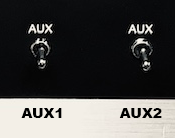

# Altair shortcuts

Note: AUX1 refers to the AUX switch on the left, AUX2 refers to the AUX switch on the right.

**Access the Altair-Duino configuration screen**

* Hold up **STOP**, keep it  held up, and hold up **AUX1**.

If you have a terminal connected, or your Altair-Duino is connected over USB to your computer, you should see the setting menu appear. This menu is the key to controlling how serial ports work, and also defining default actions when you power on. It's worth spending time learing what options are available.

**Reset default settings**

If you get the system messed up by trying out too many options, you can do a "factory reset" of the settings.

* Hold up the **RESET** toggle
* Turn on the power

The default settings expect a USB lead connected to a computer, running a terminal program and a connection over USB.

**Selecting a default disk to boot**

It's possible to set a shortcut to occur when **AUX1** is toggled up once the computer is turned on. By detault this is "Kill the Bit", which is great if you don't have a terminal attached. If you do have a terminal, it would be much more convenient to start CP/M, right? Here's how:

* Open the Altair-Duino configuration screen (see above)
* Toggle option **AUX1 shortcut program** by pressing **u** until the option you want is selected. For example, BASIC or CP/M. If you have an SD card installed, being able to start up CP/M from hard drive is very convenient.
* Once you have made your choice, you will probably want to save this as a default setting. See below.

**Storing and using default start settings**

The Altair-Duino can save multiple settings (which store default serial ports, speed, programs to launch on **AUX1** etc.) and you can select these at start-up. Here's how.

* From the Altair-Duino configuration screen, make your choices.
* Press **S** to Save configuration.
* Pick a numbers from 0 to 9.
* If you pick 0, these are the settings that apply at power-up by default (i.e. you do nothing but turn on the computer.)
* If you pick another number, you can select these in two ways: first, you can Load them from the configuration screen, but second you can use a power-up shortcut to load them. On the A3 to A0, set the binary representation of the settings number you picked. Then hold up the **DEPOSIT** button, and while holding it up, switch on the computer.

This is a really convenient way to select different launch configurations, for different terminals or different software. You will probably need to add a sticky-note to the front terminal so you remember which settings, which is fine - all Altairs back in 1975 had notes stuck to them.

**List the name of virtual disks**

* **STOP**

| 15 | 14 | 13 | 12 | 11 | 10 | 9 |  8 | 7 | 6 | 5 | 4 | 3 | 2 | 1 | 0 |
|----|----|----|----|----|----|---|----|---|---|---|---|---|---|---|---|
| 0  | 0  | 0  | 1  | 0  | 0  | 0 | 0  | 0 | 0 | 0 | 0 | 0 | 0 | 0 | 0 |

* **AUX2 down**

If you have added your own disk images, you should add their name to the DISKDIR.TXT file so it appears in the list.

**Boot CP/M from floppy**

* **STOP**

| 15 | 14 | 13 | 12 | 11 | 10 | 9 |  8 | 7 | 6 | 5 | 4 | 3 | 2 | 1 | 0 |
|----|----|----|----|----|----|---|----|---|---|---|---|---|---|---|---|
| 0  | 0  | 0  | 1  | 0  | 0  | 0 | 0  | 0 | 0 | 0 | 1 | 0 | 0 | 1 | 1 |

* **AUX2 down** (to mount the disk)

| 15 | 14 | 13 | 12 | 11 | 10 | 9 |  8 | 7 | 6 | 5 | 4 | 3 | 2 | 1 | 0 |
|----|----|----|----|----|----|---|----|---|---|---|---|---|---|---|---|
| 0  | 0  | 0  | 1  | 0  | 0  | 0 | 0  | 0 | 0 | 0 | 0 | 0 | 0 | 0 | 0 |

* **AUX1 down** (to boot the disk)

In practice, booting CP/M from floppy works, but there isn't a lot of free space on the virtual disk, and so it isn't the most flexible or useful way to work. It's much better to use an SD card with your Altair-Duino, and boot CP/M from a hard disk.

If you use this option a lot, you should have it is a default start setting (see above).

**Boot CP/M from hard drive**

* **STOP**

| 15 | 14 | 13 | 12 | 11 | 10 | 9 |  8 | 7 | 6 | 5 | 4 | 3 | 2 | 1 | 0 |
|----|----|----|----|----|----|---|----|---|---|---|---|---|---|---|---|
| 0  | 0  | 1  | 1  | 0  | 0  | 0 | 0  | 0 | 0 | 0 | 0 | 0 | 0 | 1 | 1 |

* Toggle **AUX2 down** (to mount the disk)

| 15 | 14 | 13 | 12 | 11 | 10 | 9 |  8 | 7 | 6 | 5 | 4 | 3 | 2 | 1 | 0 |
|----|----|----|----|----|----|---|----|---|---|---|---|---|---|---|---|
| 0  | 0  | 1  | 1  | 0  | 0  | 0  | 0 | 0 | 0 | 0 | 0 | 1 | 1 | 1 | 0 |

Then toggle **AUX1** to **down** (to boot the disk)

If you use this option a lot, you should have it is a default start setting (see above).

**What to do if CP/M hangs**

Sometimes something bad might happen, and your CP/M system might hang. The fix is easy: just toggle the **RESET** switch. Reset sets the program counter back to 0, and so it restarts CP/M. However, if something really, really bad happens you might have to reboot CP/M.

**Mounting disks**

Remember: you can use mount and unmount floppy or hard disks at any time - even in the middle of a CP/M session. It's only simulating the physical act of adding or removing a disk from the disk drive.