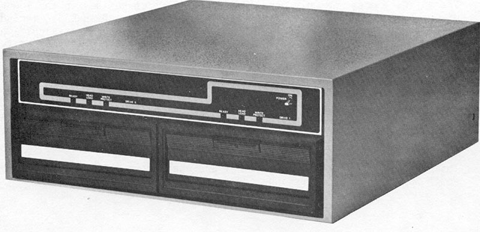

## Altair floppy disk operation (MITS Disk Controller)

The Altair can access multiple floppy disks in multiple drives. With a real Altair, you would place the floppy disks into the drives. With the Altair-Duino, the name of the disks, and drives to mount them in, are specified with the switches and the use of the AUX1 and AUX2 toggles. So this is NOT going to work on a real Altair - it's a trick to simulate using real floppy disks. It's not possible to connect a real, physical floppy disk drive to an Altair-Duino. It's for your own good, really.

This section refers for the **MITS Disk Controller**.  To use the **Tarbell Disk Contoller** see the section **Altair floppy disk operation (Tarbell Disk Controller)**.

## Display a list of available floppy disks

To see a list of available disk images that can be loaded, enter the following pattern on the address toggle switches (1 means the switch is up):

| 15 | 14 | 13 | 12 | 11 | 10 | 9 |  8 | 7 | 6 | 5 | 4 | 3 | 2 | 1 | 0 |
|----|----|----|----|----|----|---|----|---|---|---|---|---|---|---|---|
| 0  | 0  | 0  | 1  | 0  | 0  | 0 | 0  | 0 | 0 | 0 | 0 | 0 | 0 | 0 | 0 |

And toggle **AUX2** to **DOWN**.

Note: If you have added your own disks to the local file system (see The Altair Local File System), you will need to manually add the descriptions to the DISKDIR.TXT file. Be sure to terminate each description with a CR and LF character.

## Mount a specific floppy disk in the default drive

The disks on the Altair-Duino's file system are named "DISK01.DSK", "DISK02.DSK" and so on. To select a specific disk, set switch **12** to **UP** and then enter the binary representation of the disk name on switches **4** to **0**:

| 15 | 14 | 13 | 12 | 11 | 10 | 9 |  8 | 7 | 6 | 5 | 4 | 3 | 2 | 1 | 0 |
|----|----|----|----|----|----|---|----|---|---|---|---|---|---|---|---|
| 0  | 0  | 0  | 1  | 0  | 0  | 0 | 0  | 0 | 0 | 0 | x | x | x | x | x |

For example, to mount disk DISK12.DSK (by default, **Colossal Cave Adventure**), set the following switches:

| 15 | 14 | 13 | 12 | 11 | 10 | 9 |  8 | 7 | 6 | 5 | 4 | 3 | 2 | 1 | 0 |
|----|----|----|----|----|----|---|----|---|---|---|---|---|---|---|---|
| 0  | 0  | 0  | 1  | 0  | 0  | 0 | 0  | 0 | 0 | 0 | 1 | 0 | 0 | 1 | 0 |

And toggle **AUX2** to **DOWN**.

Note: This will mount the disk, as if you had physically placed a disk in the drive, but it will not run anything. If you need to boot from it, see "Boot from a floppy disk" below.

## Selecting different drives

The Altair can support up to 16 floppy drives. So far we've used the default, drive 0, which appears as drive **A:** under CP/M.

To select a different drive, you use switches **11** to **8**:

| 15 | 14 | 13 | 12 | 11 | 10 | 9 |  8 | 7 | 6 | 5 | 4 | 3 | 2 | 1 | 0 |
|----|----|----|----|----|----|---|----|---|---|---|---|---|---|---|---|
| 0  | 0  | 0  | 0  | x  | x  | x | x  | 0 | 0 | 0 | 0 | 0 | 0 | 0 | 0 |

And toggle **AUX2** to **DOWN**.

Here are how the first four drives are named under CP/M:

|    | 11 | 10 | 9 | 8 |
|----|----|----|---|---|
| A: | 0  | 0  | 0 | 0 |
| B: | 0  | 0  | 0 | 1 |
| C: | 0  | 0  | 1 | 0 |
| D: | 0  | 0  | 1 | 1 |

## Unmounting a floppy disk

To remove a floppy disk, enter the drive number as above, but toggle **AUX2** to **UP**. 

## Boot from a floppy disk

The disk in drive 0 can be used to boot the Altair, and this is typically used to start CP/M. The code required to load and boot the disk is stored on a Disk Boot ROM. Here is how you activate the Disk Boot ROM:

| 15 | 14 | 13 | 12 | 11 | 10 | 9 |  8 | 7 | 6 | 5 | 4 | 3 | 2 | 1 | 0 |
|----|----|----|----|----|----|---|----|---|---|---|---|---|---|---|---|
| ?  | ?  | ?  | ?  | ?  | ?  | ?  | ? | 0 | 0 | 0 | 0 | 1 | 0 | 0 | 0 |

Then toggle **AUX1** to **DOWN**.

This installs the Disk Boot ROM to address 0xFF00 in the Altair's memory, and starts it running. If a bootable disk is in drive 0, it will boot from it. If you are booting CP/M, you will see the **A:** prompt.

## Example

Here's how to boot from DISK13.DSK (by default, CP/M) and mount DISK10.DSK (by default, **The Hitchhikers Guide to the Galaxy**) in drive **B:**.

1. Initialize the Altair

Hold up **Stop** and **Reset**

2. Install and boot CP/M

| 15 | 14 | 13 | 12 | 11 | 10 | 9 |  8 | 7 | 6 | 5 | 4 | 3 | 2 | 1 | 0 |
|----|----|----|----|----|----|---|----|---|---|---|---|---|---|---|---|
| 0  | 0  | 0  | 1  | 0  | 0  | 0 | 0  | 0 | 0 | 0 | 1 | 0 | 0 | 1 | 1 |

**AUX2** to **DOWN**.

| 15 | 14 | 13 | 12 | 11 | 10 | 9 |  8 | 7 | 6 | 5 | 4 | 3 | 2 | 1 | 0 |
|----|----|----|----|----|----|---|----|---|---|---|---|---|---|---|---|
| 0  | 0  | 0  | 1  | 0  | 0  | 0 | 0  | 0 | 0 | 0 | 0 | 1 | 0 | 0 | 0 |

**AUX1** to **DOWN**.

CP/M will boot.

3. Mount Hitchhikers Guide

| 15 | 14 | 13 | 12 | 11 | 10 | 9 |  8 | 7 | 6 | 5 | 4 | 3 | 2 | 1 | 0 |
|----|----|----|----|----|----|---|----|---|---|---|---|---|---|---|---|
| 0  | 0  | 0  | 1  | 0  | 0  | 0 | 1  | 0 | 0 | 0 | 1 | 0 | 0 | 0 | 0 |

Toggle **AUX2** to **DOWN**.

If you now enter **DIR B:** you'll see the Hitchhikers disk ready to play.
