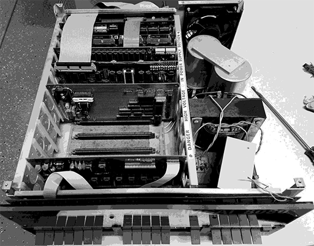

# Introduction to system architecture

Conceptually, the Altair and IMSAI computers benefitted from a very straightforward design. Inside the large boxes was a front panel with LEDs and switches, a huge power supply, and a "back plane" circuit board with almost much nothing but a set of interconnected 100-pin slots - known as the S-100 Bus.



Into those slots would be placed the various cards that comprised the computer system: first the CPU card (with an Intel 8080 or a Zilog Z80 CPU), and then a RAM card (initially composed of static RAM chips).

In theory that's all what was needed to make a working computer. Code could be entered using the front panel switches, and the LEDs provided a form of output.

 In practice, this wasn't enough and users also installed floppy and hard drive controller cards, ROM cards, more RAM, serial cards (for driving terminals and printers), parallel cards (for more printers), and even graphic display cards and camera capture cards.

**Operation**

These machines work in a predictable, straightforward manner: a Program Counter register keeps track of a location in the 64Kb memory space. When the machine is told to RUN, tt will read the contents of memory at this address, and execute it as machine code. The code will continue to run, following instructions, and updating the Program Counter accordingly. The memory map starts at 0000h, and RESET will load that value into the Program Counter.

The LEDs reflect this activity, and unless you had extra hardware attached to your computer, that's all you got. Thankfully it didn't take long before Serial cards were added, which made it possible to connect the computer to devices such as Teletypes and video terminals.

**Memory Map**

The 8080 and Z80 CPUs could address up to 64Kb of memory(*) and this would start at address 0000h and (funds permitting) go all the way to FFFFh. Memory was used to store program code and any data, and when the user set all the front panel address switches to off and toggled RESET and EXAMINE, the program counter was set to 0000h and the computer would display the contents of memory address 0000h. (Static memory chips would often contain random data, and so the data LEDs would display a random pattern.)

| Description     | Address |
|-----------------|---------|
| Start of memory | 0000h |
| Maximum supported memory   | FFFFh |

Initially the Altair shipped with 256 bytes of memory, and the IMSAI with 1Kb of memory. Why? Because memory was very expensive in 1975!

However, it soon became apparent that a lot more would be needed in order to run useful software: Microsoft's smallest version of BASIC alone required 4Kb, and so expansion cards were soon on the wish list of every computer owner.

ROMs were expensive, and so sometimes it was necessary to "boot strap" the computer manually to get a disk drive working instead on relying on code in a ROM. This would entail entering a set of assembly language instructions directly using the front panel and executing them - hopefully triggering the disk drive to load more, and execute those: thus booting up CP/M or some other application. We'll cover how you might do that in another section.

**Memory Map using CP/M**

If CP/M was loaded, memory was arranged in a specific way. Again, the memory started at 0000h, but this time CP/M included some of its code there: a set of jumps to useful routines, and of course, code at 0000h that would jump to the code that brought up the famous A: prompt to allow the user to enter commands.

The CP/M memory map looks like this:

| Description                       | Address |
|-----------------------------------|---------|
| Start of memory                   | 0000h   |
| 'Low storage' area..                   | 0000h |
| ..used by CP/M                     | 00ffh  |
| TPA - free memory for programs aka "Transient Program Area" | 0100h   |
| CCP - console command processor        | xxxxh |
| BDOS - Basic Disk Operating System                              |xxxxh|
| BIOS - Basic Input Output System                             |xxxxh|
| Maximum possible memory space      | FFFFh   |

The exact address of the CCP, BDOS and BIOS components of CP/M would vary from system to system. Depending on much memory you had installed, you would literally build your own custom version of CP/M to make full use of it. Your bespoke CP/M would also include the necessary drivers for the floppy and hard drives you added to your system.

CP/M might not be what we think of an Operating System today. It didn't provide a graphical user interface, or allow multiple programs to run at once. It didn't provide networking, or automatic updating of software or anything that we take for granted today.

CP/M was a lot more basic, and in essence wasn't much more than an implementation of an agreed set of basic functions, tailored for a specific set of hardware, coupled with a command line to let the user launch utilities and programs, and the promise that any application would be loaded in at address 0100h and executed. And that was it.

Here is an example of some code. Any application can call the CP/M "Print" function by calling the BDOS start address (00005h) and passing in the special value of 9, and the code in the BDOS will do the actual printing. It's like a primative SDK.

```ASM
; 8080 ASM code to display "hello world"

PRINT EQU 9                     ; The Print function
BDOS EQU 5                      ; The address of the BDOS code vector

org 0100h                       ; All user code starts at 0100h

LXI D, STRING                   ; Get the address of the string to print
MVI C, PRINT                    ; Load register C with the magic code for printing
CALL BDOS                       ; Call the BDOS
RET                              ; End program

; The BDOS Print needs a string ending in $
STRING: DB 'Hello World!', 10,13,'$'    
                                        
```

(BTW, if you like, you can enter this code in ED, and them assemble it with ASM, link it with LOAD and then run it under CP/M. We'll cover that later.)

This was basic, but it was also enough to create a standard platform that software developers could start to take advantage of. The weird and wonderful hardware of the day was abstracted away behind the BDOS and BIOS, allowing developers to write code and create powerful and useful apps. And write they did - CP/M was the most popular software platform in the world at the time.


**ROMs**

ROMs could be installed into the system, and they too would need to appear in the same memory map. For example, a floppy disk drive might come with a ROM of drivers, and that ROM would expect to be at a specific address - say F000h. The user could then start the code in the ROM running by selecting F000h on the address switches, toggling EXAMINE and RUN.

Some expansion cards could also combine ROM and RAM, swapping them in and out as required (they couldn't exist in the memory map at the same location at the same time).

(*) The 8080 could in theory address up to 128Kb, using the second 64Kb for stack memory.

