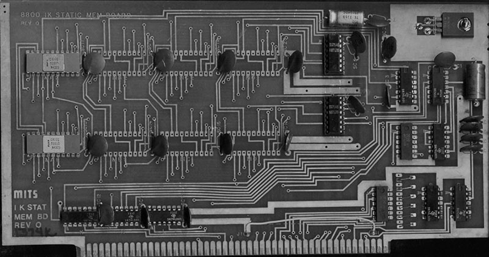
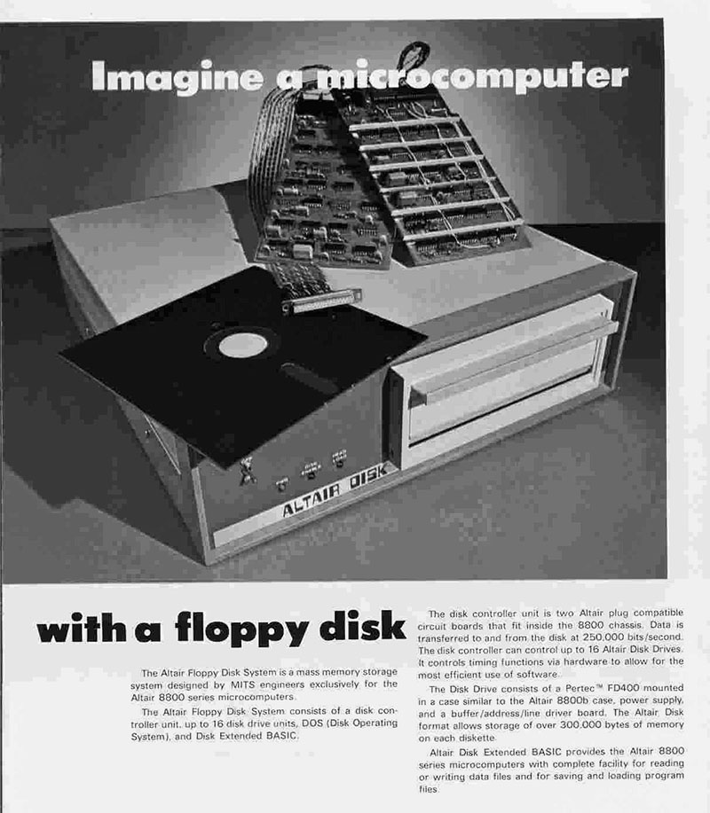

# A quick look at system architecture

Welcome to the state-of-the-art, mid-1970s edition!


Now that you have built your computer, it's time to put it to work. Let's start by learning a little about how these systems worked.

Conceptually, the Altair and IMSAI computers benefit from a straightforward design. Inside the large box is a front panel with LEDs and switches, a huge power supply, and a "back plane" circuit board which consists of almost nothing but a set of interconnected 100-pin slots - this is the S-100 Bus.


Into those slots are placed the various cards that comprise the computer system: first the CPU card (with an Intel 8080 or a Zilog Z80 CPU), and then a RAM card.

In theory that's all that's needed to make a working computer. Code an be entered using the front panel switches, and the LEDs provide visual output. No monitor, no keyboard and definitely no mouse.

 In practice, this wasn't quite enough for most people, and so 1970's users bought and installed floppy and hard drive controller cards, ROM cards, more RAM, serial cards (for driving terminals and printers), parallel cards (for more printers), even more RAM, and the very well-off ones bought graphic display cards and camera capture cards.

You, however, are lucky because you don't need to worry about the S-100 bus and selling internal organs to populate it. Your modern recreation will simulate all manner of hardware expansions for you.

**Operation**

Under the (heavy metal) covers, these computers work in a predictable, straightforward, single-minded manner: a program counter register keeps track of a location in the memory space. When the machine is told to RUN, it will read the contents of memory at this address, and execute it as machine code. The code will continue to run, following the instruction in the list, updating the program counter accordingly when it gets to JUMPS, CALLs and so on. The memory map starts at 0000h, and if you press the RESET button on the front panel, that's where the program counter will be sent. The array of LEDs reflect all this activity, giving you a peek at the address bus, data bus and status of the CPU. 

**Memory Map**

The 8080 and Z80 CPUs can address up to 64Kb of memory(*) starting at address 0000h and (funds permitting) going all the way to FFFFh, so storing up to 65,536 8-bit bytes. Memory was used to store program code and any data, and when the user set a pattern on the front panel address switches and toggled EXAMINE, the the computer would display the contents of memory address on the data LEDs. (The static memory chips used at the time would often contain random data, and so the data LEDs would display a random pattern.)

| Description     | Address |
|-----------------|---------|
| Start of memory | 0000h |
| Maximum supported memory   | FFFFh |

Initially the Altair shipped with 256 bytes of memory, and the IMSAI with 1Kb of memory. Why so little? Because memory was very expensive in 1975!

It soon became apparent that a lot more memory would be needed in order to run useful software: Microsoft's smallest version of BASIC alone required 4Kb, and so expansion cards were soon on the wish list of every computer owner.

The other type of computer memory was the ROM: memory that had been pre-programmed with code. ROMs were expensive, sometimes prohibitively so, and thus it was not unknown for users to "boot strap" the computer manually to get a disk drive working instead on relying on code in a ROM. This would entail entering a set of assembly language instructions directly using the front panel and executing them - hopefully triggering the disk drive to load and execute more code: thus booting CP/M or some other application. We'll cover how you might do that in another section.

**Memory Map using CP/M**

To simplify writing applications, and to make it easier to distribute them to different computers, it made sense to use an operating system. The most popular OS at the time, was called CP/M.

If CP/M was loaded into your computer, the memory map was arranged in a very specific way. Again, the memory started at 0000h, but this time CP/M included some of its own code there: a set of jumps to useful routines, and of course, code at 0000h that would jump to the famous A: prompt and allow the user to enter commands.

The CP/M memory map looks like this:

| Description                       | Address |
|-----------------------------------|---------|
| Start of memory                   | 0000h   |
| 'Low storage' area..                   | 0000h |
| ..used by CP/M                     | 00ffh  |
| TPA - free memory for programs aka "Transient Program Area" | 0100h   |
| CCP - Console Command Processor        | xxxxh |
| BDOS - Basic Disk Operating System                              |xxxxh|
| BIOS - Basic Input Output System                             |xxxxh|
| Maximum possible memory space      | FFFFh   |

The exact address of the CCP, BDOS and BIOS components of CP/M would vary from system to system. Depending on much memory you had installed, you would literally build your own custom version of CP/M to make full use of it. Your bespoke CP/M would also include the necessary drivers for the floppy and hard drives you added to your system.

CP/M might not be what we think of an Operating System today. It didn't provide a graphical user interface, or allow multiple programs to run at once. It didn't provide networking, or automatic updating of software or anything that we take for granted today.

CP/M was a lot more basic, and in essence wasn't much more than an implementation of an agreed set of basic functions, tailored for a specific set of hardware, coupled with a command line to let the user launch utilities and programs, and the promise that any application would be loaded in at address 0100h and executed. And that was it.

Here is an example of some code. Any application can call the CP/M "Print" function by calling the BDOS start address (00005h) and passing in the special value of 9, and the code in the BDOS will do the actual printing. It's like a primative SDK.

```ASM
; 8080 ASM code to display "hello world"

PRINT EQU 9                     ; The Print function
BDOS EQU 5                      ; The address of the BDOS code vector

ORG 0100h                       ; All user code starts at 0100h

LXI D, STRING                   ; Get the address of the string to print
MVI C, PRINT                    ; Load register C with the code for printing
CALL BDOS                       ; Call the BDOS
RET                             ; End program

; The BDOS Print needs a string ending in $
STRING: DB 'Hello World!', 10,13,'$'    
                                        
```

(BTW, if you like, you can enter this code in ED, and them assemble it with ASM, link it with LOAD and then run it under CP/M. We'll cover that later.)

This was basic, but it was also enough to create a standard platform that software developers could start to take advantage of. The weird and wonderful hardware of the day was abstracted away behind the BDOS and BIOS, allowing developers to write code and create powerful and useful apps. And write they did - CP/M was the most popular software platform in the world at the time.


**ROMs**

ROMs could be installed into the system, and they too would need to appear in the same memory map. For example, a floppy disk drive might come with a ROM of drivers, and that ROM would expect to be at a specific address - say F000h. The user could then start the code in the ROM running by selecting F000h on the address switches, toggling EXAMINE and RUN.

Some expansion cards could also combine ROM and RAM, swapping them in and out as required (they couldn't exist in the memory map at the same location at the same time).


**Expansion unlimited**


Let's say you had an Altair or IMSAI in the 70's, and you also won the lottery and could afford to get anything you wanted. Where would you start? Obviously you'd get more RAM - how about 16Kb for $4000? 



You would buy a couple of floppy drives ($1500), and since money was no object, a teletype to see what you are working on ($1500). Better add a serial card ($150) - and what the heck. 



Why not a very early video camera and capture card? It's a steal at $500. A copy of MicroSoft BASIC is another $500. 


Sorry, video terminals are a little too expensive right now - but you could get a Comter CT256 terminal, which has a keyboard and a single line of text.

With all this equipment, you've more computing power than you know what to do with! Better play some Zork..

---

(*) Udo Monk writes: "The 8080 could address up to 128Kb, using the second 64Kb for stack memory. Also later Intel CPU's (like the 8086) have segments registers, one for the stack, so that one can isolate memory used for the stack from everything else. Also if you look at how the Intel PL/M language was implemented, it won't pass parameters on the stack and no code is generated trying to directly access the stack. This feature was not used by more or less hobby machines from MITS or IMSAI, but in controllers for military usage, power plants, airplanes and so on, because software that cannot easily corrupt the stack works more reliably."

