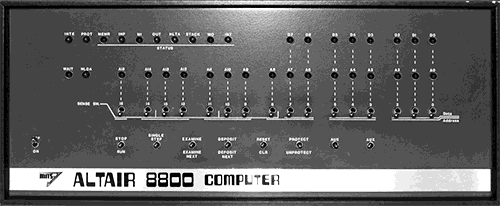
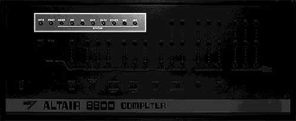
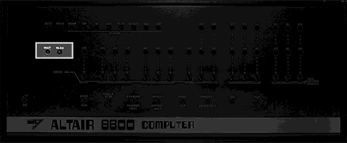
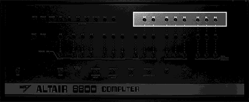
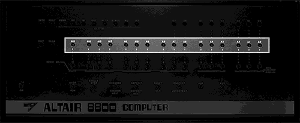
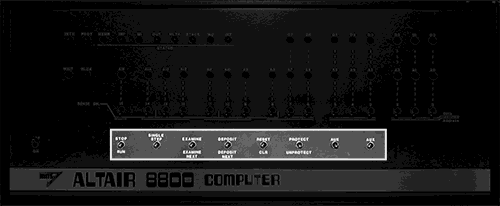
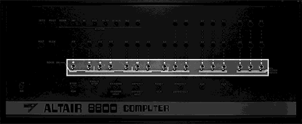

## Front panel

A distinguishing feature of the Altair and IMSAI computers is their primary user interface - the front panel covered in LEDs and switches.

Although initally overwhelming, there is a logal pattern to the designs  which you'll soon come to understand and appreciate. They provide a unique look into the working of the computer in a way that no modern system can offer.

**Altair 8800**

There are four sets of LEDs on the Altair front panel:

| LED   | Description                                                                                           |
|-----------|-------------------------------------------------------------------------------------------------------|
| Status    | Located in the top left, these ten LEDS describe the current state of the processor                    |
| WAIT/HLDA | Located just under the Status LEDs, these LEDs let you know if the computer is running (WAIT will be off), and if a HOLD has been acknowledged     .                                                               |
| Data      | Located in the right right, these eight LEDs can signify the byte stored at a specific address.           |
| Address   | Located in the middle of the panel, these sixteen LEDs represent an address in memory, from 0000h to FFFFh |

Status LEDs

| LED   | Description                                                                                          |
|-------|------------------------------------------------------------------------------------------------------|
| INTE  | An interrupt has been enabled.                                                                       |
| PROT  | The memory currently referenced by the program counter is read only. Rarely used by an Altair-Duino. |
| MEMR  | The address bus will be used to specify the memory to be read.                                       |
| INP   | The address refers to an input device.                                                               |
| MI    | The CPU is processing the first part of an instruction.                                              |
| OUT   | The address refers to an output device.                                                              |
| HLTA  | The assembly instruction HALT has been executed, and acknowledged.                                   |
| STACK | The address bus hols the Stack Pointer's push-down stack address.                                    |
| WO    | The operation being executed is a Write or Output operation.                                         |
| INT   | An interrupt request has been acknowledged.                                                          |

WAIT/HLDA LEDs

| LED  | Description                                   |
|------|-----------------------------------------------|
| WAIT | The computer is not currently executing code. |
| HLDA | A HOLD has been acknowledged.                 |

Data LEDs

When the computer is not running, the WAIT light is on, and EXAMINE or EXAMINE NEXT has been toggled, these LEDs represent the data stored at the current address.

Address LEDs

When the computer is not running, the WAIT light is on, and EXAMINE or EXAMINE NEXT, or DEPOSIT or DEPOSIT NEXT, or RESET has been toggled, these LEDs represent the current address.

**Altair control switches**

| Button            | Action                                                                                                                                                                                                                         |
|-------------------|--------------------------------------------------------------------------------------------------------------------------------------------------------------------------------------------------------------------------------|
| STOP/RUN          | Start or stop the computer from executing code at the current address.                                                                                                                                                         |
| SINGLE STEP       | If the computer is not currently running code, the WAIT light will be on, and SINGLE STEP will execute the next instruction in memory. Some systems have a SLOW option when toggled down, which repeatedly steps through code. |
| EXAMINE           | Set the program counter to the address set by the 16 switches, and display the byte at this address.                                                                                                                           |
| EXAMINE NEXT      | Increment the program counter by 1, and display the byte at this updated address.                                                                                                                                              |
| DEPOSIT           | Write the byte represented by the right-most switches into the memory at the current address.                                                                                                                                  |
| DEPOSIT NEXT      | Increment the program counter by 1, and write the byte represented by the switches into this updated address.                                                                                                                  |
| RESET             | Set the program counter to zero. If the computer is still running code, it will continue at address 0.                                                                                                                         |
| CLR               | Send a clear command to external equipment - unsupported by default on Altair-Duino/IMSAI8080esp systems.                                                                                                                      |
| PROTECT/UNPROTECT | Mark a section of memory as read only. Unsupported by default on most Altair-Duino systems.                                                                                                                      |
| AUX1              | Action depends on specific hardware installed. On Altair-Duino used to select various options.                                                                                                                   |
| AUX2              | Action depends on specific hardware installed. On Altair-Duino used to select various options.                                                                                                                   |

**Altair Address, Data and Sense switches**

These switches serve multiple purposes.

**Specify an address**

If the computer is not currently running code (the WAIT LED is on) then you can use these sixteen switches to select the address of the program counter. When all are down, the address is 0000f. When all are up, it's FFFFh.

Typically you would set the switches to specify an address, and then toggle EXAMINE. The address LEDs will change to reflect the same address, amd the data LEDs will display the byte at that address.

**Specify data**

With an address set, you might want to write a new value at that location. At this point you can use the eight right-most switches to specify the value, and then toggle DEPOSIT or DEPOSIT NEXT. The position of the switches will define the byte that is now written to memory.

**Sense**

If a program is running, the eight left-most switches can be used to provide into into the computer. The computer can use IN(0) to read the current state as an 8-bit number.

** Examples **

This can be rather confusing, so let's look at some very specific examples.

Example 1 - Start at memory address and count upwards

* Toggle STOP in case the computer is doing something.
* Set all the address switches to off i.e. down.
* Toggle RESET. This will reset the program counter to zero. All the address LEDs will be off.
* Toggle EXAMINE. As the switches are all down, you're still using the program counter at zero, so nothing will appear to happen.
* Toggle EXAMINE NEXT. The program counter will be incremented. The A0 LED will turn on. This is memory address 0001f
* Continue to toggle EXAMINE NEXT. The program counter will continue to increment, and the address LED's will count upwards in binary.
* When you get bored (hopefully in less than 65,384 times) toggle RESET and the counter will start again.

Example 2 - Read the contents of memory

* Toggle STOP, and RESET. You're back to program counter zero.
* Toggle EXAMINE. This time look at the data LEDs - the value shown is the byte at memory address 0000f.
* Toggle EXAMINE NEXT. Now the data LEDs show the value at memory address 0001f.
* Continue toggling EXAMINE NEXT for a few times. As the address LEDs show the current address, the data LEDs show the contents of memory.

Example 3 - Writing to memory and confirming the data is correct.

