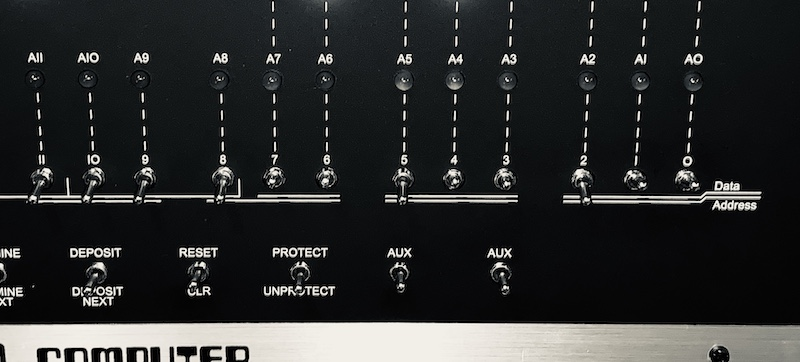

# Writing software using switches and LEDs

How on earth do you write software for a box with only LEDs and some switches? And the answer is "very carefully".

Of course no-one in their right mind would write a large application in this way, but it is possible to write simple games, or - more usefully back in the day - code that can talk to a peripheral floppy disk drive (for example) and load and run much larger programs.

**Code**

Using the switches, you can enter a byte at a time into memory. The hard part, of course, is knowing which bytes to use! 

The Altair and IMSAI use the Z80 or 8080 CPUs, which are very similar. They can perform simple instructions (adding, subtracting, comparing, logical operations) and with this list, you write software. Now that I write it out loud, it sounds crazy, but it works, honestly. 

The **instruction set** is a list of these operations and the numeric code that associated with each one. It's this numeric value that you store in memory - tedious code by tedious code.

You'll need to use the following switches to enter these "machine codes".

| Switch | Function |
|------------------------------------|------|
| Address switches | Select a memory address|
| DEPOSIT | Store a byte of memory into the current address|
| DEPOSIT NEXT | Move to the next address in memory and store a byte there|
| EXAMINE | Using the current position of the address switches to define a memory location, display the contents of the byte stored there |
| EXAMINE NEXT | Jump to the next memory location and display the contents of the byte stored there|

**Working out the right code to enter**

Let's say the instruction you want to enter at memory address 0000h is to be **IN, 0**. This instruction reads the value of the input/output port specified at **0** and stores it into register **A**.

Ok, there is probably a million things that made no sense there. Let's go through them one by one.

* Memory address 0000h is the first memory address, so a pretty good place to start a program. WHen you toggle RESET and RUN, the computer will go to address 0000h and execute the instruction it finds there.

* IN is an instruction that the CPU understands. How can you tell? Because the manufacturer of the CPU told us the list of instructions and what they do.

* IN takes a value from an **Input port**. An **Input Port** in this context isn't really a physical port you can stick your finger into. It's really a way of allowing a computer to control other electronics. For the Altair and IMSAI, it can be used to read the state of the switches on the front panel from within your program if you use port 255. We'll user port 0 which shouldn't interfere with anything for our example.

* Register A. The CPU has what you can think of as variables, that can store values from 0 to 255. The CPU can perform sums and tests on variables. A large part of the list of instructions the CPU can do is all about dealing with the registers.

OK, hopefully that's better. But how do we get the codes to enter?

As mentioned, the CPU manufacturer publishes a list of the instructions the CPU can execute, along with the number. If look up the IN instruction, you'll see that it has code DBh (in hex) and that it also takes a value to specify the port numbers. You always put any value needed by an instruction the next memory location.

This means that we would like the memory to look like this:

|Memory address|Instruction|Code|
| - | - | - |
| 0000h | IN | DBh |
| 0001h | 00h | 00h |

The DBh is the hex value for the IN, and the 0h is the port number our app needs.

Let's add another column to the table - this time the binary equivalent of the code.

|Memory address|Instruction|Code|Binary|
| - | - | - | - |
| 0000h | IN | DBh | 11011011 |
| 0001h | 00h | 00h | 00000000 |

The binary version is a pattern you can replicate using switches on the front panel of the computer, right? Sure - when the switch is up, that's a 1. When it's down, that's a 0.

**Just keeps going**

You might wonder, how does the computer know to stop at the end of the instruction we just entered? And the answer is - it doesn't. It doesn't know you only wanted to enter two numbers, and it will gleefully go to the next memory location, read the value and try to execute it. What is that value? Who knows! What we do know is that nothing good will happen. So we usually add a JUMP instruction and go back to the start or somewhere else harmless. The code for Jump is F2h and this time it takes two values to specify the address to jump to. We will make it jump back to zero.

|Memory address|Instruction|Code|Binary|
| - | - | - | - |
| 0000h | IN | DBh | 11011011 |
| 0001h | 00h | 00h | 00000000 |
| 0002h | JP | F2h | 11110010 |
| 0003h | 00h | 0h | 11000010 |
| 0004h | 00h | 0h | 11000010 |

Now we have a program! It doesn't do anything useful, but it's a program!

**Entering the codes**

Let's enter this program.

1. First, toggle STOP to stop the computer.
2. Make sure all the switches are down, and toggle RESET. This will set the current address to 0000h, which is where will want to start.
3. Now we need to enter the code 11011011.

Use the switches labeled A7 to A0, the right-most group of switches. Set A7, A6, A4, A3, A1 and A0 up and the others down.

4. Now toggle the DEPOSIT button. Make sure to toggle it up, not down.

5. This writes the value DBh into memory. The Data status LEDs will change to reflect this.

6. Now set the switches for the value 0h. (Hint: A7 to A0 should all be down!)

7. Toggle the DESPOSIT NEXT switch. This moves to the next address, and THEN stores the new value.

8. Again, the Data LEDs will show the pattern you entered and the Address LEDs will show address 0001h (that is, all Address LEDs off except one).

9. Repeat for all the lines of code in the table above.

**Confirming the codes are correct**

Before you run code, even useless code like this, it's good to check you have entered it correctly.

1. Make sure all the switches are down, and toggle EXAMINE.

2. The Data LEDs should show ON ON OFF ON ON OFF ON ON (11011011).

3. Toggle EXAMINE NEXT and the LEDs should change to 00000000.

4. Repeat for all the values you entered. Made a mistake? You would have to correct it if this was a real application. You can use EXAMINE and EXAMINE NEXT to get to the right location, set the switches and use DEPOSIT to store the correct value.

**Running, stopping and single-stepping**

To start this piece of code from running:

1. Toggle RESET.
2. Toggle RUN.
3. The program will start. You won't really know though, other than some of the Address LEDs will light up.
4. Toggle STOP.

Well done! You launched and stopped your program running!

Now try this:

1. Toggle RESET.
2. Toggle SINGLE STEP up.
3. Watch what happens - the computer will read and execute a new instruction every time you toggle up SINGLE STEP.
4. Keep an eye on the Address LEDs - they will count up to 4, and then back to zero.

**Saving and loading**

How would you save such a carefully entered piece of software? Well, unless you added some extra hardware, you couldn't save it. If you ever turned the computer off, the program would be lost forever.

Storage systems were therefore high on every computer owner's list. The cheapest was the humble cassette tape. Many expansion cards included support for saving and loading memory to tape as audio tones.

Floppy disks were considerably more convenient (but expensive), and eventually hard drives came along with literally megabytes of storage. 

Early adaptors may have used paper tape to store programs too - the first version of Microsoft BASIC was sold on paper tape. To load it, you needed a tape reader - a loud and expensive machine. 