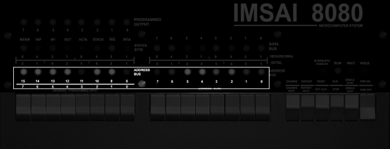

## Front panel

A distinguishing feature of the Altair and IMSAI computers is their primary user interface - the front panel covered in LEDs and switches.

Although initially overwhelming, there is a logical pattern to the designs  which you'll soon come to understand and appreciate. They provide a unique look into the working of the computer in a way that no modern system can offer.


There are five sets of LEDs on the IMSAI front panel:

| LED   | Description                                                                                           |
|-----------|-------------------------------------------------------------------------------------------------------|
| Programmed Output    | Located in the top left, these eight LEDS are under software control.                   |
|Status byte | Located just under the Programmed Output LEDs, these LEDs let you know what the CPU is doing. |
| Data      | Located in the center, these eight LEDs can signify the byte stored at a specific address.           |
| Address   | Located in the lower left and center of the panel, these sixteen LEDs represent an address in memory, from 0000h to FFFFh |
| Run/Wait   | Located in the lower right, these four LEDs tell you if the computer is currently running. |


**Programmed Output LEDs**


The LEDs are under software control. When a value is sent to I/O Port 255, the inverse binary number is displayed. For example, sending 0 to OUT 255 will turn all LEDs on, and sending 255 to OUT 255 will turn them all off. The CMP A instruction is useful, as it will quickly invert the value of register A, making the output more natural.

e.g.

```asm
MVI A, F0h
CMA
OUT FFh
 ```
will turn on the first four LEDs. Leave out the CMA and it will turn on the second four LEDs.

**Status Byte**


These LEDs give you a very low-level glimpse into what the CPU inside the computer is actually doing. You rarely need to use these unless you are debugging machine code.

| LED   | Description                                                                                          |
|-------|------------------------------------------------------------------------------------------------------|
| MEMR  | The address bus will be used to specify the memory to be read.                                       |
| INP   | The address refers to an input device.                                                               |
| M1    | The CPU is processing the first part of an instruction.                                              |
| OUT   | The address refers to an output device.                                                              |
| HLTA  | The assembly instruction HALT has been executed, and acknowledged.                                   |
| STACK | The address bus holds the Stack Pointer's push-down stack address.                                   |
| WO    | The operation being executed is a Write or Output operation.                                         |
| INTA   | An interrupt request has been acknowledged.                                                         |

**Data LEDs**


When the computer is not running, the WAIT light is on, and EXAMINE or EXAMINE NEXT has been toggled, these LEDs represent the data stored at the current address.


**Address LEDs**



When the computer is not running, the WAIT light is on, and EXAMINE or EXAMINE NEXT, or DEPOSIT or DEPOSIT NEXT, or RESET has been toggled, these LEDs represent the current address.

**INTERRUPT/RUN/WAIT/HOLD LEDs**


| LED  | Description                                   |
|------|-----------------------------------------------|
| INTERRPUPTS ENABLED  | An interrupt has been enabled.                                                                       |
| RUN | The computer is currently executing code. |
| WAIT | The computer is not currently executing code. |
| HOLD | A HOLD has been acknowledged.                 |


**IMSAI control switches**


| Button            | Action                                                                                                                                                                                                                         |
|-------------------|--------------------------------------------------------------------------------------------------------------------------------------------------------------------------------------------------------------------------------|
 EXAMINE           | Set the program counter to the address set by the 16 switches, and display the byte at this address.                                                                                                                           |
| EXAMINE NEXT      | Increment the program counter by 1, and display the byte at this updated address.   |
| DEPOSIT           | Write the byte represented by the right-most switches into the memory at the current address.   |
| DEPOSIT NEXT      | Increment the program counter by 1, and write the byte represented by the switches into this updated address. |
| RESET             | Set the program counter to zero. If the computer is still running code, it will continue at address 0.                                                                                                                         |
| EXT. CLR.               | Send a clear command to external equipment - unsupported by default on IMSAI8080esp systems.                                                                                                                      |
| STOP/RUN          | Start or stop the computer from executing code at the current address.   |
| SINGLE STEP       | If the computer is not currently running code, the WAIT light will be on, and SINGLE STEP will execute the next instruction in memory. |
 PWR ON/OFF          | Turn on or off the computer.   |


**IMSAI Address, Data and Sense switches**


These switches serve multiple purposes.

**Specify an address**

If the computer is not currently running code (the WAIT LED is on) then you can use these sixteen switches to select the address of the program counter. When all are down, the address is 0000h. When all are up, it's FFFFh.

Typically you would set the switches to specify an address, and then toggle EXAMINE. The address LEDs will change to reflect the same address, amd the data LEDs will display the byte at that address.

**Specify data**

With an address set, you might want to write a new value at that location. At this point you can use the eight right-most switches to specify the value, and then toggle DEPOSIT or DEPOSIT NEXT. The position of the switches will define the byte that is now written to memory.

**Sense**

If a program is running, the eight left-most switches can be used to provide into into the computer. The computer can use IN(0) to read the current state as an 8-bit number.


**Examples**

This can be rather confusing, so let's look at some very specific examples.

Example 1 - Start at memory address and count upwards

* Toggle STOP in case the computer is doing something.
* Set all the address switches to off i.e. down.
* Toggle RESET. This will reset the program counter to zero. All the address LEDs will be off.
* Toggle EXAMINE. As the switches are all down, you're still using the program counter at zero, so nothing will appear to happen.
* Toggle EXAMINE NEXT. The program counter will be incremented. The A0 LED will turn on. This is memory address 0001h
* Continue to toggle EXAMINE NEXT. The program counter will continue to increment, and the address LED's will count upwards in binary.
* When you get bored (hopefully in less than 65,384 times) toggle RESET and the counter will start again.

Example 2 - Read the contents of memory

* Toggle STOP, and RESET. You're back to program counter zero.
* Toggle EXAMINE. This time look at the data LEDs - the value shown is the byte at memory address 0000h.
* Toggle EXAMINE NEXT. Now the data LEDs show the value at memory address 0001h.
* Continue toggling EXAMINE NEXT for a few times. As the address LEDs show the current address, the data LEDs show the contents of memory.

Example 3 - Writing to memory and confirming the data is correct.

* Toggle STOP, and RESET. The program counter is set to zero.
* Set all address toggle switches to off.
* Toggle EXAMINE. The address LEDs will all be off, as the memory address 0000h.
* Turn the right-most address toggle switch to on.

| 15 | 14 | 13 | 12 | 11 | 10 | 9 |  8 | 7 | 6 | 5 | 4 | 3 | 2 | 1 | 0 |
|----|----|----|----|----|----|---|----|---|---|---|---|---|---|---|---|
| 0  | 0  | 0  | 0  | 0  | 0  | 0 | 0  | 0 | 0 | 0 | 0 | 0 | 0 | 0 | 1 |

* Toggle DEPOSIT (not DEPOSIT NEXT)
* The Data LEDs will show one LED lit (the right most), and the Address LEDs will still all be off. You've just pushed a value of 1 into memory address 0.
* Change the toggle switches to the switch to the left:

| 15 | 14 | 13 | 12 | 11 | 10 | 9 |  8 | 7 | 6 | 5 | 4 | 3 | 2 | 1 | 0 |
|----|----|----|----|----|----|---|----|---|---|---|---|---|---|---|---|
| 0  | 0  | 0  | 1  | 0  | 0  | 0 | 0  | 0 | 0 | 0 | 0 | 0 | 0 | 1 | 0 |

* Toggle DEPOSIT NEXT. This updates the program counter to the next address, and pushes in a value of 2.

Remember your binary?

| 7 | 6 | 5 | 4 | 3 | 2 | 1 | 0 |
|---|---|---|---|---|---|---|---|
| 128 | 64 | 32 | 16 | 8 | 4 | 2 | 1 |

Let's set two toggle switches to create a value of 3.

| 15 | 14 | 13 | 12 | 11 | 10 | 9 |  8 | 7 | 6 | 5 | 4 | 3 | 2 | 1 | 0 |
|----|----|----|----|----|----|---|----|---|---|---|---|---|---|---|---|
| 0  | 0  | 0  | 1  | 0  | 0  | 0 | 0  | 0 | 0 | 0 | 0 | 0 | 0 | 1 | 1 |

* Toggle DEPOSIT NEXT. This updates the program counter to the next address, and pushes in a value of 3.

* Repeat this process until you get bored.

* Now let's read back the memory. Toggle RESET, and set all the address switches to off.

* Toggle EXAMINE, to see the contents of address 0 - which should be a 1.
* Toggle EXAMINE NEXT to see the contents of address 1 - which should be a 2.
* Repeatedly toggle EXAMINE NEXT, and you should see not only the address LEDs increment, but your data values too.