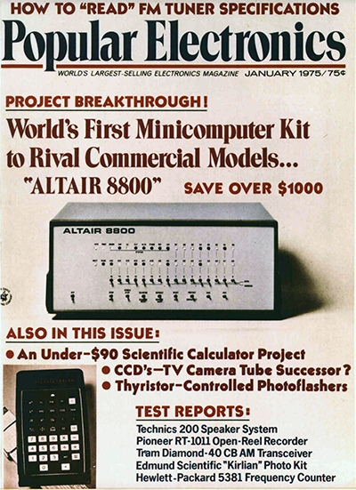

# Introduction

You've built your retro computer kit.

It sits there, with its LEDs blinking and switches beckoning. You're almost thinking of ordering another one, because putting this one together was so much fun.

But wait! Building it was only half the adventure - now you get to use it!

**But really, can it do anything?**

Yes! Here's a short list of things you can do with your Altair or IMSAI kit.

* Learning about binary, octal and hexidecimal numbering systems. 
* Learn assembly language programming.
* Play some classic games (Read "Ready Player One?") that are actually good, and without social media notifications distracting you.
* Learn how to use one of the earliest operating systems: CP/M. Download and try literally thousands of applications.
* Solve some gnarly problems as you set up serial terminals, mount virtual disk drives, and play with bit rates and device ports.
* Write software in assembler, BASIC, C, FORTH, Algol and other languages and turn your computer into a clock or other monitoring system, so it can sit on your shelf doing something useful.
* Learn about, and build electronics, that interface with the computer, and connect it with the modern world of networks and internets.
* Learn about computer history, and create something your kid can bring to a science fair.

**Learning** is a large part of it, and the skills you learn will be applicable to even today's computer challenges - albeit in a simpler, kinder way. It's also fun, and a lot easier and cheaper than it was when this stuff was new, back in 1975.

**Everything in context**

When the Altair 8800 was released in early 1975, and the IMSAI 8080 followed not long after, the idea of a "home" or "personal" computer didn't exist.

Businesses, universities and some very well-off schools may have had a mini computer (such as a DEC PDP-11), and used it to run some pay-roll tasks or even provide BASIC programming, but no-one had a computer at home. Why would they? They were hugely expensive and hugely **huge** too.

At this time, Intel and other IC manufacturers were working on creating chips like the 8008 and 8080, intended for embedding into electronic systems and devices to replace hundreds of simpler logic chips - such as point of sale terminals, military systems or high-end car electronics.

Some far-sighted individuals realized that these micro-processors (which cost only hundreds of dollars, rather than the thousands for the ones used in larger computers) were good enough to build entire computers around.

First, projects started appearing in hobbyist magazines, and then companies started selling kits and even pre-built versions. As the number of these "micro computers" grew, they created a new market for add-on peripherals and software. 

By 1980, the home computer revolution was well under way!
