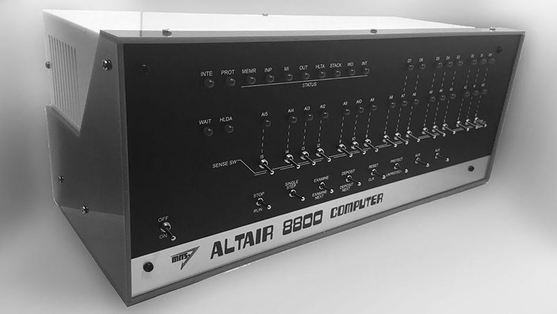
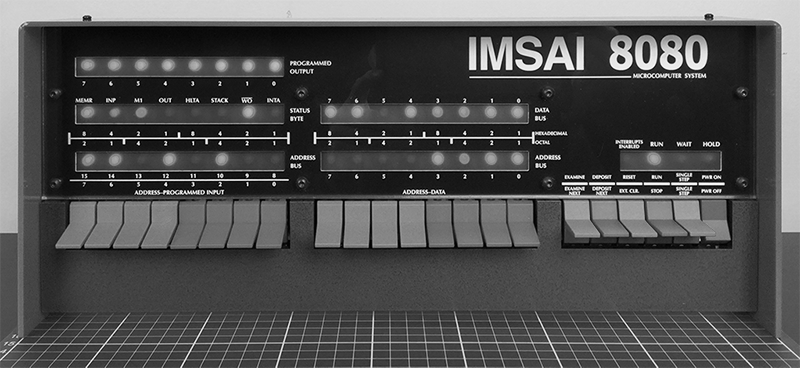

# Retro computer kits

**Altair 8800**

AdWaterAndStir, Altair-Duino

Link: https://www.adwaterandstir.com/altair/

**IMSAI 8080**

The High Nibble, IMSAI 8080 replica

Link: https://thehighnibble.com/imsai8080/

**Other systems**

 If you prefer a more modern take on a Z80 based computer, look out for the [RC2014](https://rc2014.co.uk/) series of kits. If you would prefer to go old-school, then check out the [Altair 8800c](https://deramp.com/altair_8800c.html) and the [S-100 Computers](http://s100computers.com/) site.

Although a completely different kettle of fish, no mention of retro-computing kits would be complete without listing the [PiDP-8](https://obsolescence.wixsite.com/obsolescence/pidp-8) and [PiDP-11](https://obsolescence.wixsite.com/obsolescence/pidp-11) from Oscar Vermeulen.
