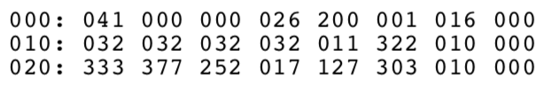

# Numbers

| Hex | Decimal | Octal | Binary    |
|-----|---------|-------|-----------|
| 00  | 0       |   00  | 0000 0000 |
| 01  | 1       |   01  | 0000 0001 |
| 02  | 2       |   02  | 0000 0010 |
| 03  | 3       |   03  | 0000 0011 |
| 04  | 4       |   04  | 0000 0100 |
| 05  | 5       |   05  | 0000 0101 |
| 06  | 6       |   06  | 0000 0110 |
| 07  | 7       |   07  | 0000 0111 |
| 08  | 8       |   10  | 0000 1000 |
| 09  | 9       |   11  | 0000 1001 |
| 0A  | 10      |   12  | 0000 1010 |
| 0B  | 11      |   13  | 0000 1011 |
| 0C  | 12      |   14  | 0000 1100 |
| 0D  | 13      |   15  | 0000 1101 |
| 0E  | 14      |   16  | 0000 1110 |
| 0F  | 15      |   17  | 0000 1111 |

**Using Octal**

Using octal (base 8) can speed up code entry, as it maps very well to the panel switches and is a little easier to do in your head than hexidecimal.

The Altair and IMSAI obviously use binary - with each switch is a bit - but it is also common to use octal when entering Z80 or 8080 opcode instructions.

To see how this is done, consider the last eight (the ‘least significant’) switches on the panel:

(ignore the one on the far left - we only need the 7 to 0 switches and LEDs, as these describe 8 bits)

You can already think of these in binary, of course. So the setting above with all lights off would be this:

00000000

Here's a slightly more interesting pattern:

This pattern would represent 10010010

Let’s group this example into units of 3 bits, as the front panel subtly hints at with the spacing between the LEDs and switches. 

10 010 010

And look! We can write this in octal as 222. Why 222?

The first '01' group is 2, and in octal this is also 2.
The second '010' is also 2 in octal.
The third '010' (the one on the far right) is also 2 in octal.
Thus, 10 010 010 is 222.

Some more examples in case you don't quite get it:

00 000 001 == 001

01 001 111 == 113

10 010 110 == 226

11 111 111 == 377

So any grouping of switch 7 to switch 0 can be written using a three digit octal number. 

If you can express your machine code program in octal, it makes it a lot quicker to enter the codes and press **DEPOSIT**.

e.g. You could write a program on piece of paper as:

101 123 301 234 343

Or, to help you keep track, the memory address can be used in a column on the left:

If you are looking for a list of OpCodes in octal, you will find a table based on this one in the Appendices page.